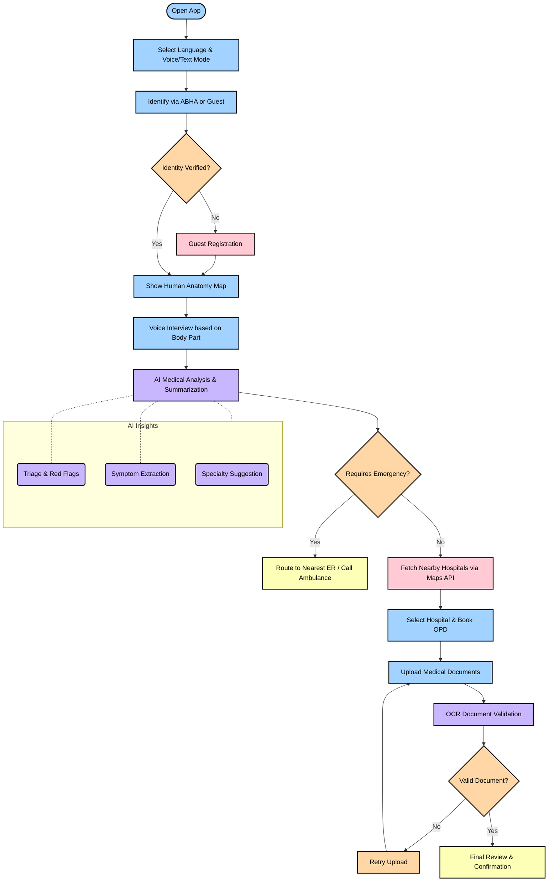

# MediKiosk — Architecture

> Living doc. Verified against the codebase during the hardening roadmap (STEPS 0–7). Contracts change — re-check code before building on any claim here.

## 1. Overview

MediKiosk is a bilingual (5-language), voice-first health kiosk + patient portal. A patient on the kiosk floor books an OPD slot, is triaged by AI (vitals/red-flags), and walks away with a scannable QR slip. The same patient then manages visits, documents, and profile from the web portal; hospital admins run OPD/triage/queue and doctor-facing tools; clinicians triage the queue and can OCR handwritten prescriptions.

## 2. Tech Stack

| Category | Technologies |
|---|---|
| **Frontend** | React 19, TypeScript, Vite 8, Tailwind CSS v4, Zustand, Framer Motion, React Router v7 |
| **Backend** | Python 3.14, FastAPI, Uvicorn, SQLAlchemy (Async) |
| **AI & APIs** | Google Gemini (Speech-to-Text & NLP Summaries), EasyOCR (Vision), WebRTCVAD (Audio), Google Maps Places API |
| **Databases** | PostgreSQL (via Supabase), Redis (Caching) |
| **Deployment** | Docker, Render, Supabase Auth/Storage |
| **Security & Roles** | Casbin (RBAC), JWT verification via FastAPI middlewares |

Demo mode: Offline-capable mock services serve seeded hospitals/doctors/slots/visits/documents so the portal can run independently.

## 3. Routing & Guards

`src/App.tsx` single `<Routes>`; portal/staff routes lazy-loaded under `<ProtectedRoute>`:

| Guard roles | Paths | Notes |
|---|---|---|
| public | `/`, `/login`, `/register`, `/unauthorized`, `/kiosk/*` |  |
| `patient` | `/patient/*` incl. `/patient/kiosk` | dashboard, book-opd, visits, timeline, documents, profile, kiosk |
| `hospital_admin` (+`doctor` for vitals/retention) | `/hospital/*` | dashboard, opd, triage, queue, doctors, departments, vitals, data-retention |
| `doctor` | `/doctor/*` | dashboard, queue, patient/:id, schedule, scan-qr, ocr |
| never-matching role | `/physician/*`, `/admin/*` | lazy legacy dashboards; **everyone → `/unauthorized`** |

Guard logic: `isLoading` → spinner; not authed → `/login`; role mismatch → `/unauthorized`. All auth/guarded navigations use `replace`.

## 4. Data & Auth Flow

- `authStore.initialize()` (App mount): Supabase → demo mock (synchronous in demo, so tests are deterministic).
- Patient portal hits **Supabase directly** (decision, not a gap): `hospitals`, `departments`, `doctors`, `opd_slots`, `visits`, `patients`/`profiles`, `documents`, storage bucket `patient-documents`.
- Backend (`backend/app/routers/`): `auth`, `health`, `sessions` (voice-first kiosk), `voice` (`/transcribe` ASR + `/tts` TTS — new), `patients`, `documents` (MinIO), `summaries` (Gemini), `physician`, `abdm`, `advanced` (OCR, QR, ML priority, vitals analyze, emergency verify, body-map, retention/DPDPA).

## 5. Cross-Cutting Services (new)

| Service | What it does |
|---|---|
| `src/services/BhashiniService.ts` | Singleton, 15 methods (translate, ASR, TTS, transliterate, OCR, detect, normalize, profanity-filter, denoise, entities, gender). Proxies backend `/voice`, `/advanced`; throttle + 1 retry on 500/502/503/504; AbortController timeout; local fallbacks. `export const bhashini`. |
| `src/lib/i18n.ts` | 5-language dictionaries (en/hi/ta/bn/mr), `t(key, lang, vars)`, reactive `useT()` bound to `useUIStore.language`, `APP_LANGS`, `DictKey` type (TS-safe). Wired into kiosk, Dashboard, BookOPD, MyVisits, KioskLayout. |
| `src/lib/opdDraft.ts` | OPD wizard persistence: auto-save every selection to `sessionStorage`, restore on refresh (per-patient, toast), clear on successful booking. |
| `src/api/client.ts` | Central axios: token attach, GET retry-once on 5xx/network (idempotent-safe), 401 → clear token + reset auth store (guards redirect to `/login`), `getErrorMessage()`. |

## 6. One End-to-End Story — OPD Booking

1. Patient lands `/patient/dashboard` (demo: auto-login Rahul).
2. "Start Kiosk Mode" → `/patient/kiosk` (2-min auto-exit, WCAG high-contrast, language chips).
3. `BookOPD` 7-step wizard: Hospital → Department (symptom-suggested) → Doctor → Date & Time (slot with token capacity) → Intake (chief complaint, vitals, document upload) → Review → Confirmed + QR slip.
4. Draft auto-saves to `sessionStorage` (`opdDraft.ts`) — refresh resumes.
5. On confirm: `visits` row inserted, `opd_slots.current_tokens` incremented, uploaded files → `patient-documents` + `documents` row.
6. QR slip generated client-side (qrcode lib).
7. Visit shows in `MyVisits`; cancel decrements slot tokens; past visits upload files into timeline; DocumentsVault lists/downloads via signed URLs.

## 7. Test Status (Playwright, demo server :5179)

| Suite | Result |
|---|---|
| route-test (landing/auth redirects, back-nav, BookOPD load) | 10/10 ✅ |
| kiosk-test (layout, mic state, auto-exit, language switch) | 12/12 ✅ |
| nav-test (patient sidebar back-nav) | 4/4 ✅ |
| step5-test (legacy guards, hospital/doctor, i18n) | 13/13 ✅ |
| OPD booking + draft restore | 7/7 ✅ |
| final regression (all modules) | 23/23 ✅ |

`npm run build` = `tsc && vite build` — green.

## 8. Remaining / Known Gaps

| Area | Gap | Priority |
|---|---|---|
| Voice | `bhashini` singleton + backend `/voice/tts` exist but no UI wiring yet: kiosk "Tap to Speak" and intake are still placeholders ("Full speech support arrives…"). Real mic→ASR→TTS loop is the next feature. | High |
| Backend | Not running in demo (`/api/v1` down) → physician/admin/data-retention pages show empty/loading unless backend + `VITE_API_URL` present. | High (infra) |
| Tests | Playwright suites live in `/tmp` — not committed to repo; `test:e2e` script has no test files. | Medium |
| QR | BookOPD signs QR client-side; backend `/advanced/qr/create` (server-signed slip) unused. | Low |
| Legacy | `/physician` `/admin` dashboards dead-but-blocked; safe to delete later. | Low |
| i18n | Landing has only 2 langs; app has 5. Reuse `lib/i18n` on landing. | Low |
| Git | All STEP-0..7 changes uncommitted (`ARCHITECTURE.md`, `ROUTING_FIX.md`, kiosk/, i18n.ts, opdDraft.ts, services/, voice.py, tts_client.py, …). | Do it |