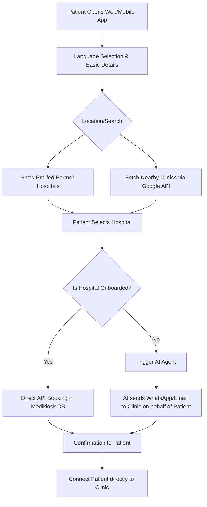
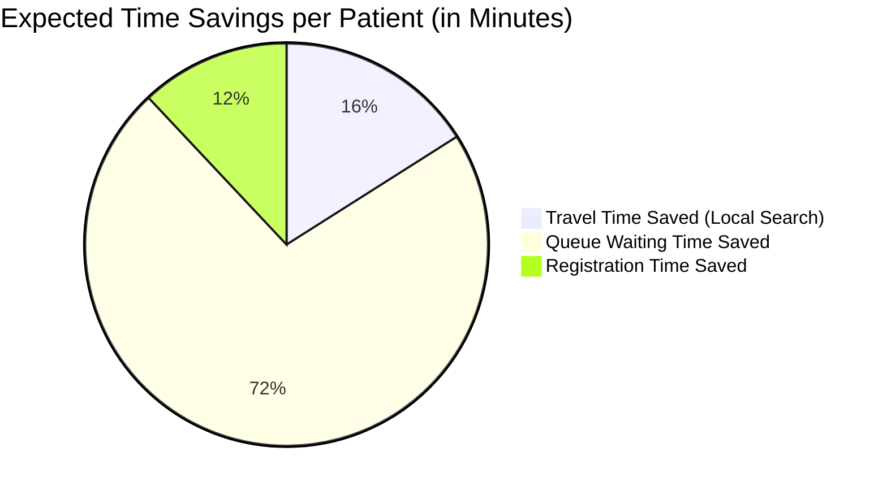
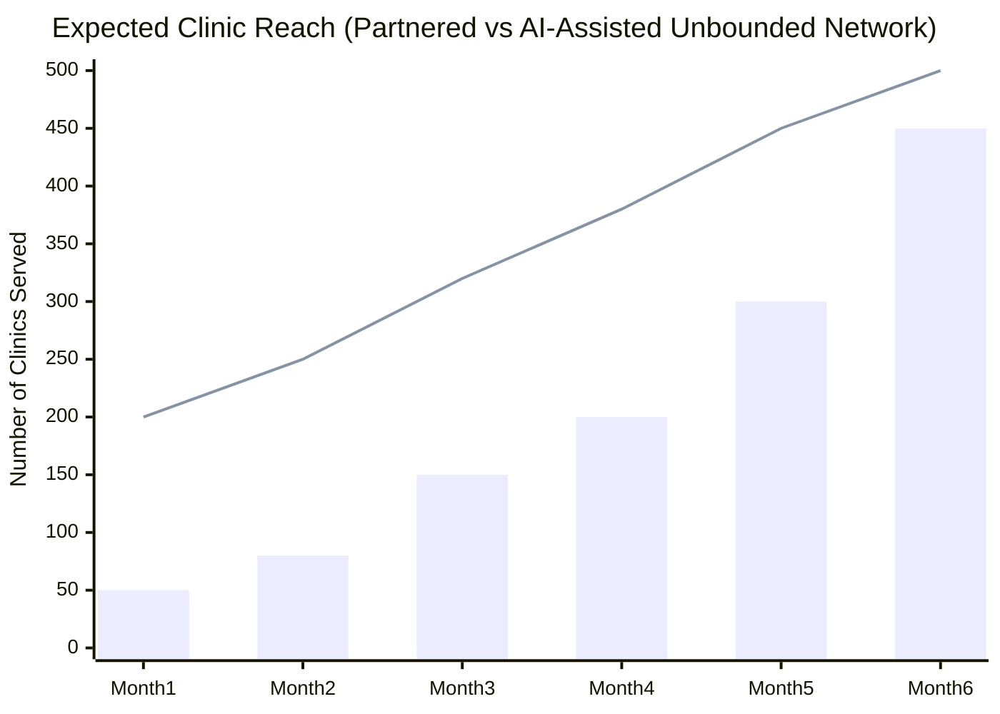
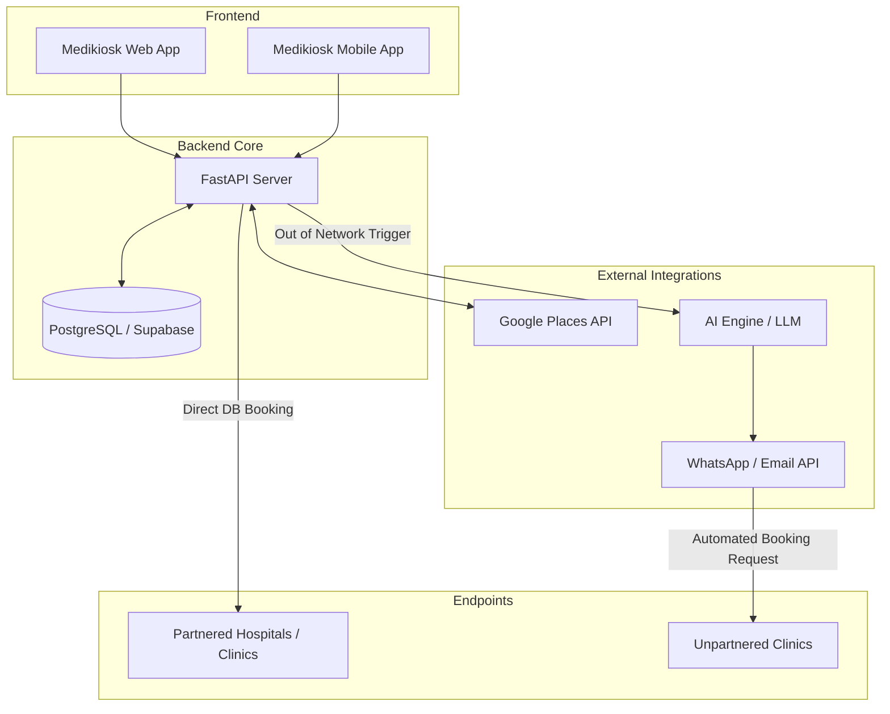

# Medikiosk: AI-Powered Universal OPD Booking Web & Mobile App

## Introduction / The Hook

When was the last time you walked into a government hospital for a consultation or to get your illness diagnosed? For most of us, the answer would be "maybe a long time ago"—so long that we can't even recall, or perhaps we've never even visited a state-sponsored healthcare facility. 

Why is that so? Do we not have qualified doctors? If you think yes, you're completely wrong. Most doctors who serve in government hospitals come from very competitive and rigorous academic backgrounds. Their ability and qualifications cannot be undermined. The real problem with state-sponsored healthcare is a **lack of systemic efficiency**. 

Efficient public healthcare systems *do* exist in the West (in countries like the UK, the US, and Canada), where the majority of the population relies on them. However, here in India, those of us with privilege choose to opt for private healthcare at a much higher cost simply because of the efficiency and the reduced time it takes to get a checkup or diagnosis. 

Medikiosk is here to change that narrative by bringing world-class digital efficiency to the Indian healthcare system—bridging the gap between the highly qualified doctors in public/local hospitals and the patients who need them.

So, what can be done to make the healthcare system in our country better? Be it private healthcare or government healthcare? A catalyst for that change is our project **MediKiosk Bharat**. Given the size of our country’s population and the limited number of healthcare professionals, it is important to eliminate the time taken in an entire treatment procedure to ensure that the system becomes more efficient and the population at large benefits from this increased efficiency.

So, how does MediKiosk increase efficiency? To put this into picture, I would first like to explain the flow of visiting a doctor and getting consulted and diagnosed for treatment. The process usually begins with making an appointment with the doctor and visiting them with the medical history and reports that one may have, followed by some vital checks by the doctor and their diagnosis, followed by the patient's queries. 

The problem with this method is the time taken in the entire process. Since a doctor has to go through a lot of reports and medical history within a short span of time, the time actually devoted for diagnosis and understanding the patient’s concern becomes very less. But what if a doctor already has the patient’s medical records, concerns, and difficulties faced by the patient? Wouldn’t they be able to devote more time actually speaking to the patient and addressing their queries? This is exactly what MediKiosk does.

---

## The Story: The Problem & The Solution

**The Problem:** 
Imagine Ram, a daily wage worker in India. He wakes up early, loses a day's pay, and travels miles just to stand in an unmanaged, hours-long queue outside a local clinic. When he gets there, he struggles with language barriers at the registration desk. Meanwhile, thousands of local clinics like this one remain entirely offline, disconnected from modern digital booking networks. Patients are forced into a fragmented system where finding care requires physical presence and endless waiting.

**The Solution:** 
Medikiosk changes this narrative. Ram simply opens the Medikiosk web or mobile app, selects his native language, and enters his basic details. He sees a list of nearby clinics. Even if the clinic he selects *isn't* formally registered with Medikiosk, he isn't blocked. Instead, our **Unbounded AI Agent** takes over—automatically messaging or emailing the clinic on Ram's behalf to secure an appointment. Medikiosk breaks down language barriers, digitizes the unorganized healthcare sector passively, and ensures patients can book *any* clinic without boundaries.

---
## Slide 1: Proposed Solution

### Describe your Idea/Solution/Prototype
MediKiosk is an intelligent bot that acts as the first point of interaction between the patient and the doctor. The process begins with the patient visiting the MediKiosk portal and choosing from one of 12 Indian languages (including English) using the **Bhashini API**. The ChatBot engages the patient, asking follow-up questions about their medical history, current problems, duration of symptoms, previous consultations, preferred treatment locations, and health insurance policy. 

Once this information is collected, MediKiosk summarizes the entire conversation. The patient then uploads previous health records (prescriptions, surgery history, medicinal records, insurance policies, diagnostic reports). Using both the conversation summary and the uploaded records, MediKiosk concludes the patient's primary problem, searches for the best-suited doctor, and books an appointment. Finally, these summaries and health records are uploaded to the **Ayushman Bharat Portal** and forwarded directly to the doctor *before* the visit—saving immense time for both the patient and the doctor.

### How it addresses the problem
In India, overcrowded hospitals and clinics lead to long, unmanaged queues. Many smaller clinics remain offline and inaccessible via digital platforms. Medikiosk solves this by offering an inclusive entry point (a highly accessible, multilingual app interface) and uniquely addressing the unorganized sector.

### Innovation and Uniqueness of the Solution: The Unbounded AI Agent
The most innovative feature of Medikiosk is its **"Unbounded Network"** capability:
- After language selection and basic detail entry, the system shows pre-fed (partnered) hospitals, OR utilizes Google Places API to show nearby clinics/hospitals.
- **If a user selects a non-partnered clinic**, our system doesn't block the transaction. Instead, an **AI Agent automatically initiates contact** with the clinic on the patient's behalf.
- The AI sends an automated, professional WhatsApp message or Email to the non-partnered clinic, requesting an appointment and connecting the patient directly.
- **Result:** We don't boundary our service to only onboarded hospitals. Users can book *any* clinic through one single interface.

---

## Slide 2: Methodology & Process

### Technologies to be used
- **Frontend / App Interface:** React.js, React Native / Tailwind CSS (for mobile-friendly, accessible UI)
- **Backend:** Python (FastAPI) for high-performance concurrent request handling
- **External Integrations:** 
  - **Bhashini API:** For real-time, accurate translation across 12 Indian languages.
  - **Ayushman Bharat Portal:** For syncing and storing patient health records natively.
  - **Google Nearby Places API:** To fetch location-based unlisted/non-partnered clinics.
  - **AI / Automation:** LLM for medical conversation summarization, WhatsApp Business API / Twilio, Email services for outreach.
- **Database:** PostgreSQL (Supabase) for patient data and appointments

### Methodology and Process for Implementation

---

## Slide 3: Feasibility and Viability

### Analysis of the Feasibility of the Idea
- **Technical Feasibility:** High. APIs for mapping (Google), messaging (WhatsApp), and AI processing are mature and readily available.
- **Market Viability:** Very High. WhatsApp is ubiquitous in India, even among small business owners and local clinics. Leveraging this existing habit ensures communication is received and understood without requiring clinics to install new software.

### Potential Challenges and Risks
1. **Clinic Non-Responsiveness:** Non-partnered clinics might ignore automated WhatsApp messages or emails.
2. **Spam Flagging:** High volume of automated WhatsApp messages might get the agent number flagged as spam.
3. **Real-time Confirmation Delay:** Out-of-network bookings rely on manual clinic acknowledgment, delaying instant confirmation for the patient.

### Strategies for Overcoming these Challenges
1. **Humanized AI Messaging:** Design the WhatsApp messages to sound professional yet human, clearly stating it's a patient request to improve response rates. Include interactive buttons (Accept/Reject/Reschedule) via WhatsApp API.
2. **Verified Business Account:** Use a verified Meta WhatsApp Business API account to prevent spam blocks and build trust with clinics.
3. **Graceful Degradation / Fallback:** If a clinic doesn't respond within a specified time, the system informs the patient and suggests the nearest *partnered* hospital with a confirmed slot.

---

## Slide 4: Impact and Benefits

### Potential Impact on the Target Audience
Medikiosk democratizes healthcare access, especially for the elderly, rural migrants in urban centers, and those not tech-savvy enough to navigate complex hospital apps. By acting as a universal aggregator, it ensures patients find care regardless of a hospital's digital maturity.

### Benefits of the Solution
- **Social:** Reduces anxiety and physical strain of waiting in lines. Promotes equitable healthcare access across different languages and literacy levels.
- **Economic:** Recovers millions of hours lost in hospital queues, allowing daily wage earners to save time. Actively brings new footfall to small, local, unorganized clinics.
- **Environmental:** Optimizes travel by directing patients to the nearest available clinics, reducing unnecessary vehicular emissions.

### Visualizing the Impact

*(Bar: Partnered Clinics, Line: Total Clinics Reached via AI Agent)*

---

## Slide 5: References and Research Work

- **Ayushman Bharat Digital Mission (ABDM):** Aligning with India's goal for an integrated digital health infrastructure. [Details](https://abdm.gov.in/)
- **Google Maps Platform:** For Nearby Search API implementation. [Docs](https://developers.google.com/maps/documentation/places/web-service/search-nearby)
- **WhatsApp Business Platform:** For AI agent messaging integration. [Docs](https://developers.facebook.com/docs/whatsapp/)
- **Research on OPD Queues in India:** Studies showing average wait times in Indian government and private hospitals highlight the problem's scale and the need for decentralized booking.

---

## Simple Architecture Diagram

